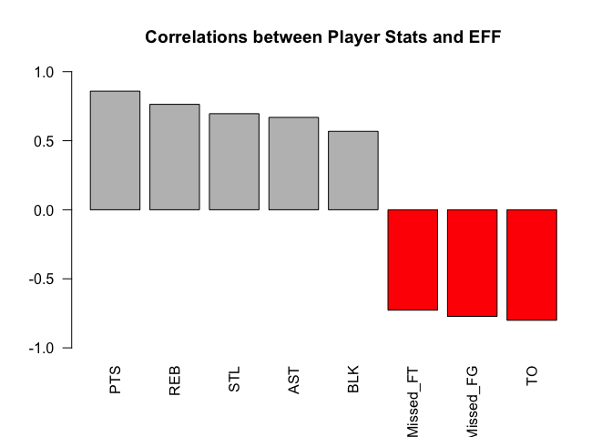
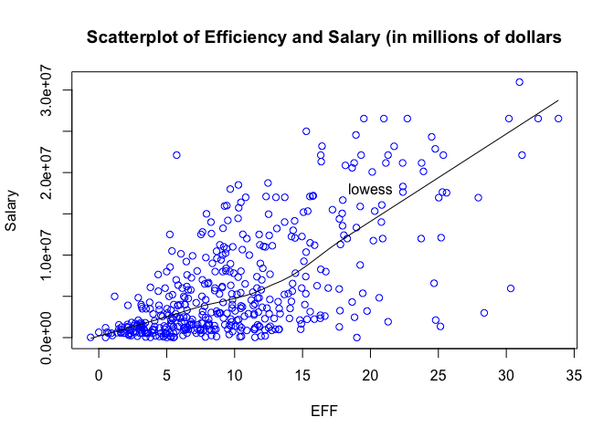
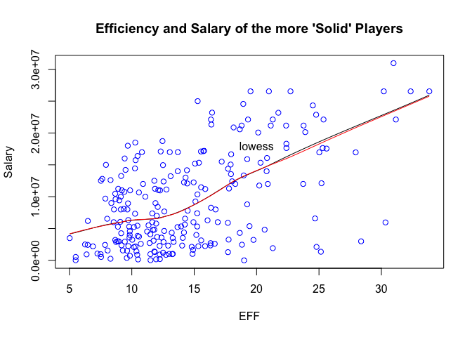

HW 2
================

``` r
library(readr)
```

### 2) Import the data in R

``` r
base <- read.csv(file = "/Users/deborahchang/Desktop/stat133/stat133-hws-fall17/hw02/data/nba2017-player-statistics.csv", header = TRUE, colClasses = c("Player" = "character", "Team"  = "character", "Position" = "factor", "Experience" ="character", "Salary" = "double"))
str(base)
```

    ## 'data.frame':    441 obs. of  24 variables:
    ##  $ Player      : chr  "Al Horford" "Amir Johnson" "Avery Bradley" "Demetrius Jackson" ...
    ##  $ Team        : chr  "BOS" "BOS" "BOS" "BOS" ...
    ##  $ Position    : Factor w/ 5 levels "C","PF","PG",..: 1 2 5 3 4 3 4 5 4 2 ...
    ##  $ Experience  : chr  "9" "11" "6" "R" ...
    ##  $ Salary      : num  26540100 12000000 8269663 1450000 1410598 ...
    ##  $ Rank        : int  4 6 5 15 11 1 3 13 8 10 ...
    ##  $ Age         : int  30 29 26 22 31 27 26 21 20 29 ...
    ##  $ GP          : int  68 80 55 5 47 76 72 29 78 78 ...
    ##  $ GS          : int  68 77 55 0 0 76 72 0 20 6 ...
    ##  $ MIN         : int  2193 1608 1835 17 538 2569 2335 220 1341 1232 ...
    ##  $ FGM         : int  379 213 359 3 95 682 333 25 192 114 ...
    ##  $ FGA         : int  801 370 775 4 232 1473 720 58 423 262 ...
    ##  $ Points3     : int  86 27 108 1 39 245 157 12 46 45 ...
    ##  $ Points3_atts: int  242 66 277 1 111 646 394 35 135 130 ...
    ##  $ Points2     : int  293 186 251 2 56 437 176 13 146 69 ...
    ##  $ Points2_atts: int  559 304 498 3 121 827 326 23 288 132 ...
    ##  $ FTM         : int  108 67 68 3 33 590 176 6 85 26 ...
    ##  $ FTA         : int  135 100 93 6 41 649 217 9 124 37 ...
    ##  $ OREB        : int  95 117 65 2 17 43 48 6 45 60 ...
    ##  $ DREB        : int  369 248 269 2 68 162 367 20 175 213 ...
    ##  $ AST         : int  337 140 121 3 33 449 155 4 64 71 ...
    ##  $ STL         : int  52 52 68 0 9 70 72 10 35 26 ...
    ##  $ BLK         : int  87 62 11 0 7 13 23 2 18 17 ...
    ##  $ TO          : int  116 77 88 0 25 210 79 4 68 39 ...

``` r
readrWay <- read_csv(file = "/Users/deborahchang/Desktop/stat133/stat133-hws-fall17/hw02/data/nba2017-player-statistics.csv", col_names = TRUE, col_types = cols(Player = col_character(), Team = col_character(), Position = col_factor(NULL), Experience = col_character(), Salary = col_double()))
str(readrWay)
```

    ## Classes 'tbl_df', 'tbl' and 'data.frame':    441 obs. of  24 variables:
    ##  $ Player      : chr  "Al Horford" "Amir Johnson" "Avery Bradley" "Demetrius Jackson" ...
    ##  $ Team        : chr  "BOS" "BOS" "BOS" "BOS" ...
    ##  $ Position    : Factor w/ 5 levels "C","PF","SG",..: 1 2 3 4 5 4 5 3 5 2 ...
    ##  $ Experience  : chr  "9" "11" "6" "R" ...
    ##  $ Salary      : num  26540100 12000000 8269663 1450000 1410598 ...
    ##  $ Rank        : int  4 6 5 15 11 1 3 13 8 10 ...
    ##  $ Age         : int  30 29 26 22 31 27 26 21 20 29 ...
    ##  $ GP          : int  68 80 55 5 47 76 72 29 78 78 ...
    ##  $ GS          : int  68 77 55 0 0 76 72 0 20 6 ...
    ##  $ MIN         : int  2193 1608 1835 17 538 2569 2335 220 1341 1232 ...
    ##  $ FGM         : int  379 213 359 3 95 682 333 25 192 114 ...
    ##  $ FGA         : int  801 370 775 4 232 1473 720 58 423 262 ...
    ##  $ Points3     : int  86 27 108 1 39 245 157 12 46 45 ...
    ##  $ Points3_atts: int  242 66 277 1 111 646 394 35 135 130 ...
    ##  $ Points2     : int  293 186 251 2 56 437 176 13 146 69 ...
    ##  $ Points2_atts: int  559 304 498 3 121 827 326 23 288 132 ...
    ##  $ FTM         : int  108 67 68 3 33 590 176 6 85 26 ...
    ##  $ FTA         : int  135 100 93 6 41 649 217 9 124 37 ...
    ##  $ OREB        : int  95 117 65 2 17 43 48 6 45 60 ...
    ##  $ DREB        : int  369 248 269 2 68 162 367 20 175 213 ...
    ##  $ AST         : int  337 140 121 3 33 449 155 4 64 71 ...
    ##  $ STL         : int  52 52 68 0 9 70 72 10 35 26 ...
    ##  $ BLK         : int  87 62 11 0 7 13 23 2 18 17 ...
    ##  $ TO          : int  116 77 88 0 25 210 79 4 68 39 ...
    ##  - attr(*, "spec")=List of 2
    ##   ..$ cols   :List of 24
    ##   .. ..$ Player      : list()
    ##   .. .. ..- attr(*, "class")= chr  "collector_character" "collector"
    ##   .. ..$ Team        : list()
    ##   .. .. ..- attr(*, "class")= chr  "collector_character" "collector"
    ##   .. ..$ Position    :List of 3
    ##   .. .. ..$ levels    : NULL
    ##   .. .. ..$ ordered   : logi FALSE
    ##   .. .. ..$ include_na: logi FALSE
    ##   .. .. ..- attr(*, "class")= chr  "collector_factor" "collector"
    ##   .. ..$ Experience  : list()
    ##   .. .. ..- attr(*, "class")= chr  "collector_character" "collector"
    ##   .. ..$ Salary      : list()
    ##   .. .. ..- attr(*, "class")= chr  "collector_double" "collector"
    ##   .. ..$ Rank        : list()
    ##   .. .. ..- attr(*, "class")= chr  "collector_integer" "collector"
    ##   .. ..$ Age         : list()
    ##   .. .. ..- attr(*, "class")= chr  "collector_integer" "collector"
    ##   .. ..$ GP          : list()
    ##   .. .. ..- attr(*, "class")= chr  "collector_integer" "collector"
    ##   .. ..$ GS          : list()
    ##   .. .. ..- attr(*, "class")= chr  "collector_integer" "collector"
    ##   .. ..$ MIN         : list()
    ##   .. .. ..- attr(*, "class")= chr  "collector_integer" "collector"
    ##   .. ..$ FGM         : list()
    ##   .. .. ..- attr(*, "class")= chr  "collector_integer" "collector"
    ##   .. ..$ FGA         : list()
    ##   .. .. ..- attr(*, "class")= chr  "collector_integer" "collector"
    ##   .. ..$ Points3     : list()
    ##   .. .. ..- attr(*, "class")= chr  "collector_integer" "collector"
    ##   .. ..$ Points3_atts: list()
    ##   .. .. ..- attr(*, "class")= chr  "collector_integer" "collector"
    ##   .. ..$ Points2     : list()
    ##   .. .. ..- attr(*, "class")= chr  "collector_integer" "collector"
    ##   .. ..$ Points2_atts: list()
    ##   .. .. ..- attr(*, "class")= chr  "collector_integer" "collector"
    ##   .. ..$ FTM         : list()
    ##   .. .. ..- attr(*, "class")= chr  "collector_integer" "collector"
    ##   .. ..$ FTA         : list()
    ##   .. .. ..- attr(*, "class")= chr  "collector_integer" "collector"
    ##   .. ..$ OREB        : list()
    ##   .. .. ..- attr(*, "class")= chr  "collector_integer" "collector"
    ##   .. ..$ DREB        : list()
    ##   .. .. ..- attr(*, "class")= chr  "collector_integer" "collector"
    ##   .. ..$ AST         : list()
    ##   .. .. ..- attr(*, "class")= chr  "collector_integer" "collector"
    ##   .. ..$ STL         : list()
    ##   .. .. ..- attr(*, "class")= chr  "collector_integer" "collector"
    ##   .. ..$ BLK         : list()
    ##   .. .. ..- attr(*, "class")= chr  "collector_integer" "collector"
    ##   .. ..$ TO          : list()
    ##   .. .. ..- attr(*, "class")= chr  "collector_integer" "collector"
    ##   ..$ default: list()
    ##   .. ..- attr(*, "class")= chr  "collector_guess" "collector"
    ##   ..- attr(*, "class")= chr "col_spec"

### 3) Right after importing the data

``` r
base$Experience <- as.integer(replace(base$Experience, base$Experience == "R", "0"))
```

### 4) Performance of Players

``` r
base$Missed_FG <- base$FGA - base$FGM
base$Missed_FT <- base$FTA - base$FTM
base$PTS <- 3*base$Points3 + 2*base$Points2 + base$FTM
base$REB <- base$OREB + base$DREB
base$MPG <- base$MIN / base$GP 

base$EFF <- (base$PTS + base$REB + base$AST + base$STL + base$BLK - base$Missed_FG - base$Missed_FT - base$TO) / base$GP
summary(base$EFF)
```

    ##    Min. 1st Qu.  Median    Mean 3rd Qu.    Max. 
    ##  -0.600   5.452   9.090  10.137  13.247  33.840

``` r
hist(base$EFF, main = "Histogram of Efficiency (EFF)", xlab = "EFF", ylab = "Frequency")
```


``` r
sortEFF <- sort(base$EFF, decreasing = TRUE)
topTenByEFFValues <- sortEFF[1:10]
topTenByEFFPlayer <- base$Player[sortEFF[1:10]]
topTenByEFFTeam <- base$Team[sortEFF[1:10]]
topTenByEFFSalary <- base$Salary[sortEFF[1:10]]
frame <- data.frame(topTenByEFFPlayer, topTenByEFFTeam, topTenByEFFSalary, topTenByEFFValues)

frame
```

    ##    topTenByEFFPlayer topTenByEFFTeam topTenByEFFSalary topTenByEFFValues
    ## 1       Delon Wright             TOR           1577280          33.83951
    ## 2        Cory Joseph             TOR           7330000          32.34568
    ## 3      Bruno Caboclo             TOR           1589640          31.16000
    ## 4   Tristan Thompson             CLE          15330435          30.97297
    ## 5   Tristan Thompson             CLE          15330435          30.32927
    ## 6   Tristan Thompson             CLE          15330435          30.19355
    ## 7       LeBron James             CLE          30963450          28.37500
    ## 8       Kyrie Irving             CLE          17638063          27.94118
    ## 9         Kevin Love             CLE          21165675          25.60526
    ## 10        Kevin Love             CLE          21165675          25.36364

``` r
base[base$EFF < 0, 1]
```

    ## [1] "Patricio Garino"

``` r
cor(base$EFF, base$PTS)
```

    ## [1] 0.8588644

``` r
cor(base$EFF, base$REB)
```

    ## [1] 0.7634501

``` r
cor(base$EFF, base$AST)
```

    ## [1] 0.6689232

``` r
cor(base$EFF, base$STL)
```

    ## [1] 0.6957286

``` r
cor(base$EFF, base$BLK)
```

    ## [1] 0.5679571

``` r
cor(base$EFF, -base$Missed_FG)
```

    ## [1] -0.7722477

``` r
cor(base$EFF, -base$Missed_FT)
```

    ## [1] -0.7271456

``` r
cor(base$EFF, -base$TO)
```

    ## [1] -0.8003289

``` r
correlations <- c(cor(base$EFF, base$PTS), cor(base$EFF, base$REB),cor(base$EFF, base$AST),cor(base$EFF, base$STL),
+ cor(base$EFF, base$BLK),
+ cor(base$EFF, -base$Missed_FG),
+ cor(base$EFF, -base$Missed_FT),
+ cor(base$EFF, -base$TO))

correlations <- sort(correlations, decreasing = TRUE)
barplot(correlations, main = "Correlations between Player Stats and EFF", width = 0.5, names.arg  = c("PTS", "REB", "STL", "AST", "BLK", "Missed_FT", "Missed_FG", "TO"), las = 2, ylim = c(-1,1), col = c("gray", "gray", "gray", "gray", "gray", "red", "red", "red"))
```



### 5) Efficiency and Salary

``` r
scatter.smooth(base$EFF, base$Salary, main = "Scatterplot of Efficiency and Salary (in millions of dollars", xlab = "EFF", ylab = "Salary", col = "blue")
text(20, 1.8*10^7, labels = "lowess")
```



``` r
cor(base$EFF, base$Salary)
```

    ## [1] 0.655624

Based on the correlation between these two variables, there seems to be a somewhat positive relationship between efficiency and salary earned for each player.

``` r
players2 <- base[base$MPG > 20, ]

scatter.smooth(players2$EFF, players2$Salary, main = "Efficiency and Salary of the more 'Solid' Players", xlab = "EFF", ylab = "Salary", col = "blue")

lines(lowess(players2$EFF, players2$Salary), col = "red")
text(20, 1.8*10^7, labels = "lowess")
```



``` r
cor(players2$EFF, players2$Salary)
```

    ## [1] 0.5367224

In the case of the "more established" players, there seems to be less of an association, where other factors aside from those calculated in the EFF formula play a role in performance.

### 6) Comments and Reflections

-   Some things that were hard were indexing rows based on certain conditions.
-   Some straightforward concepts included creating plots and analyzing these images.
-   I utilized GSI and instructor office hours; the assignment took me about 3 hours.
-   The most time consuming part was importing and cleaning the data.
-   I still have some questions about row slicing for certain conditions.
-   It was exciting to import the data and go through the process of analysis.
